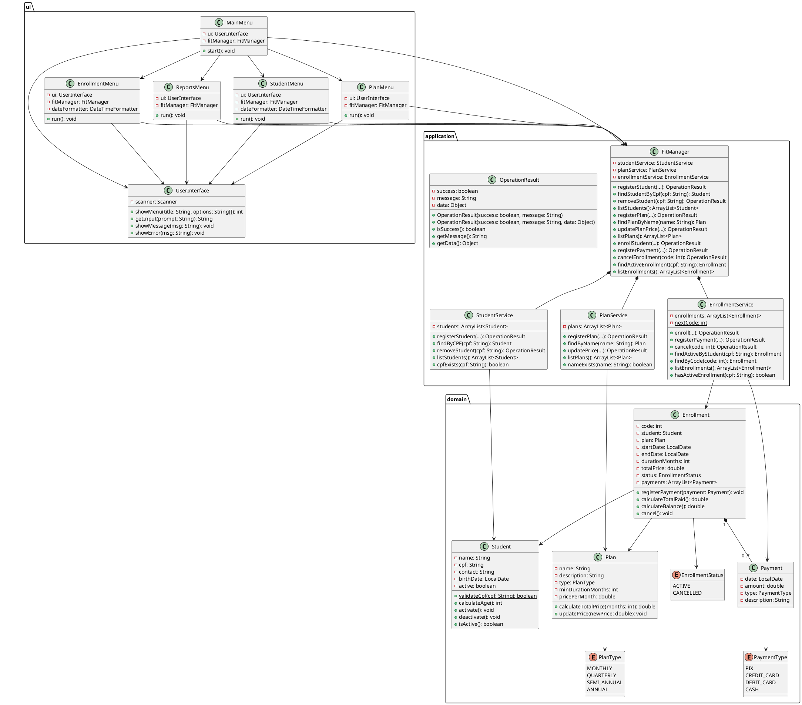

# FitManager — Relatório da Primeira Etapa

## 1. Introdução

O FitManager é um sistema de gerenciamento para academias desenvolvido em Java como projeto da disciplina de Linguagem de Programação Orientada a Objetos. Nesta primeira etapa, foi construída a base funcional do sistema: modelagem do domínio, implementação das operações essenciais e organização do código em camadas.

O sistema é capaz de gerenciar alunos, planos, matrículas e pagamentos por meio de uma interface de menus interativos no terminal. A arquitetura foi estruturada em três camadas bem definidas: Interface do Usuário, Aplicação e Domínio, com separação clara de responsabilidades entre elas, de forma a facilitar a evolução do projeto nas etapas seguintes.

---

## 2. Integrantes e Contribuições

| Integrante | Foco principal |
|---|---|
| Lucas Dias Squinca | Camada de Domínio (`Student`, `Plan`, `Enrollment`, `Payment`, enums) |
| Pedro Rodrigues Rocha | Camada de Aplicação (`FitManager`, `StudentService`, `PlanService`, `EnrollmentService`, `OperationResult`) |
| Luis Henrique Gonzaga Botelho | Camada de Interface (`UserInterface`, `MainMenu`, `StudentMenu`, `PlanMenu`, `EnrollmentMenu`, `ReportsMenu`) e apoio à camada de Aplicação |

A divisão por camadas não representou uma separação de conhecimento, mas uma estratégia prática para viabilizar o desenvolvimento paralelo. As decisões de projeto foram discutidas e tomadas em conjunto pelo grupo ao longo de todo o processo, cada integrante precisava entender as responsabilidades das outras camadas para que as interfaces entre elas fizessem sentido.

**Dinâmica de desenvolvimento:** A rotina de estudos e trabalho dos integrantes impediu reuniões frequentes de desenvolvimento conjunto. O grupo optou por uma abordagem distribuída: cada integrante avançava em sua camada localmente, e as dúvidas e decisões eram alinhadas por mensagem ou em encontros pontuais. Essa dinâmica exigiu que os contratos entre camadas, as assinaturas dos métodos do `FitManager`, os retornos de `OperationResult`, as classes de domínio, fossem definidos e acordados antes de cada um iniciar sua implementação, para que as partes se encaixassem ao ser integradas.

A integração final foi realizada em uma reunião síncrona do grupo, onde as três camadas foram conectadas, os testes manuais foram executados e os ajustes necessários foram feitos em conjunto antes de subir o código para o repositório.

---

## 3. Diagrama de Classes Final

O diagrama abaixo reflete o sistema conforme implementado. A estrutura geral segue o diagrama original proposto no enunciado, com as adaptações descritas na seção de Decisões de Projeto.

---

## 4. Decisões de Projeto

### 4.1 Inativação em vez de remoção física do aluno

**Decisão:** Ao "remover" um aluno, o sistema o marca como inativo via `deactivate()` em vez de eliminá-lo fisicamente da coleção do `StudentService`.

**Alternativas consideradas:** Remoção física do objeto `Student` da `ArrayList`.

**Justificativa:** Remover fisicamente o objeto `Student` deixaria as instâncias de `Enrollment` com uma referência a um objeto que não existe mais na lista do serviço, o que poderia causar inconsistências nos relatórios e consultas históricas. A inativação preserva o histórico íntegro e mantém o vínculo entre matrícula e aluno válido em memória. O atributo `active` já estava previsto no diagrama original, o que confirma que esse comportamento foi antecipado no projeto.

**Impacto:** As listagens exibem o status `ATIVO` ou `INATIVO` para cada aluno. Um aluno inativo ainda aparece no histórico de matrículas, mas não pode ser matriculado novamente enquanto inativo.

---

### 4.2 Armazenamento do CPF sem formatação

**Decisão:** O CPF é armazenado como string de 11 dígitos numéricos, sem pontos ou hífen (ex.: `12345678900`).

**Alternativas consideradas:** Armazenar com formatação (`123.456.789-00`) e normalizar antes de cada busca.

**Justificativa:** Guardar sem formatação simplifica comparações via `equals()` e elimina a necessidade de normalização em toda busca. O método `validateCpf()` já verifica que a entrada tem exatamente 11 caracteres numéricos antes de qualquer operação, garantindo que o dado armazenado seja sempre consistente.

**Impacto:** O usuário deve digitar o CPF sem formatação. A exibição nas listagens também é sem formatação, uma decisão que pode ser revisada nas etapas seguintes sem impactar a lógica de negócio.

---

### 4.3 Validação de CPF apenas por formato básico

**Decisão:** O método `validateCpf()` em `Student` verifica apenas comprimento (11 caracteres) e se todos os caracteres são numéricos. Não implementa o algoritmo de verificação dos dígitos verificadores.

**Alternativas consideradas:** Implementar o algoritmo completo de validação dos dois dígitos verificadores.

**Justificativa:** O algoritmo completo aumentaria a robustez do sistema, mas também sua complexidade de implementação e de testes. Para esta etapa, o grupo priorizou a corretude estrutural da arquitetura. A validação de formato é suficiente para garantir que o dado armazenado tenha a forma esperada e que CPFs claramente inválidos sejam rejeitados. O algoritmo completo pode ser adicionado ao método existente sem qualquer alteração na arquitetura.

**Impacto:** CPFs com formato válido mas dígitos verificadores incorretos são aceitos pelo sistema. Isso é uma limitação conhecida e documentada.

---

### 4.4 `totalPrice` calculado e armazenado no construtor de `Enrollment`

**Decisão:** O valor total da matrícula é calculado via `plan.calculateTotalPrice(durationMonths)` no momento da criação do objeto `Enrollment` e armazenado no atributo `totalPrice`. Não é recalculado em nenhum outro momento.

**Alternativas consideradas:** Calcular `totalPrice` dinamicamente a partir do plano sempre que necessário.

**Justificativa:** O cálculo dinâmico tornaria o contrato suscetível a alterações futuras no preço do plano, o que violaria a consistência histórica do sistema, uma academia não pode alterar retroativamente o valor de um contrato já firmado. Ao armazenar no momento da criação, o `Enrollment` torna-se autossuficiente: mesmo que o preço do plano seja atualizado posteriormente, a matrícula existente permanece inalterada.

**Impacto:** `Enrollment.calculateBalance()` opera sobre `totalPrice` estático e a lista de pagamentos dinâmica, garantindo cálculo correto do saldo em qualquer momento.

---

### 4.5 Pagamento inicial como qualquer valor positivo

**Decisão:** A regra de pagamento mínimo inicial na matrícula é satisfeita por qualquer valor maior que zero.

**Alternativas consideradas:** Exigir o pagamento de pelo menos uma mensalidade (equivalente a `pricePerMonth`), ou um percentual fixo do valor total.

**Justificativa:** A especificação exige que a matrícula seja efetivada com um pagamento inicial, mas não define um valor mínimo específico. O grupo interpretou que qualquer valor positivo satisfaz a regra, pois academias reais têm políticas variadas de entrada, algumas aceitam pagamento parcial no ato. Essa decisão simplifica o fluxo de matrícula sem violar nenhuma restrição explícita do enunciado.

**Impacto:** A validação `amount <= 0` é realizada no `FitManager` antes de delegar ao `EnrollmentService`, mantendo a verificação na camada de orquestração, fora do domínio.

---

### 4.6 Instanciação dos menus sob demanda no `MainMenu`

**Decisão:** Os objetos de menu (`StudentMenu`, `PlanMenu`, `EnrollmentMenu`, `ReportsMenu`) são instanciados dentro do `switch` do `MainMenu` a cada vez que o usuário seleciona a opção correspondente.

**Alternativas consideradas:** Instanciar todos os menus no início do programa e mantê-los como atributos do `MainMenu`.

**Justificativa:** A instanciação sob demanda é mais econômica em memória e mais simples de implementar nesta etapa, já que os menus não carregam estado entre chamadas, eles apenas coletam dados e delegam ao `FitManager`. Como `UserInterface` e `FitManager` são passados como parâmetro ao construtor de cada menu, a criação repetida não causa inconsistências. A alternativa de pré-instanciar todos os menus seria adequada caso houvesse estado a preservar entre visitas, o que não ocorre aqui.

**Impacto:** Nenhum impacto funcional observado. A decisão pode ser revisada na etapa seguinte sem alterações em outras camadas.

---

### 4.7 `endDate` calculada no construtor de `Enrollment`

**Decisão:** A data de término da matrícula é calculada como `startDate.plusMonths(durationMonths)` diretamente no construtor de `Enrollment`.

**Alternativas consideradas:** Calcular em um método separado ou delegar ao `EnrollmentService`.

**Justificativa:** A `endDate` depende exclusivamente de dois atributos do próprio objeto (`startDate` e `durationMonths`). Pela regra prática descrita no enunciado se a operação usa apenas dados de um objeto, ela pertence a esse objeto, o cálculo no construtor é a alocação mais coesa. Além disso, o método `plusMonths()` da API `LocalDate` foi projetado exatamente para esse fim e trata corretamente meses de tamanhos variados.

**Impacto:** `endDate` é imutável após a criação da matrícula, o que é o comportamento esperado para um contrato com período definido.

---

### 4.8 Seleção de `PlanType` e `PaymentType` por menu numerado

**Decisão:** Os valores dos enums são apresentados ao usuário como opções numeradas via `showMenu()`, e a escolha é mapeada para o enum correspondente no menu.

**Alternativas consideradas:** Aceitar a entrada como texto e converter para o enum via `Enum.valueOf()`.

**Justificativa:** A abordagem por menu numerado é mais robusta: o usuário só pode escolher entre as opções válidas, eliminando erros de digitação e a necessidade de normalização de texto. A abordagem por texto livre exigiria tratamento de exceções adicionais e seria menos amigável ao usuário. O mesmo padrão foi aplicado tanto para `PlanType` (no `PlanMenu`) quanto para `PaymentType` (no `EnrollmentMenu`), garantindo consistência em todo o sistema.

---

### 4.9 Atomicidade no fluxo de matrícula

**Decisão:** O `EnrollmentService.enroll()` cria o `Enrollment` e o `Payment` inicial na mesma operação. Se a validação de duração falhar, nenhum dos dois objetos é adicionado à coleção.

**Alternativas consideradas:** Criar a matrícula primeiro e registrar o pagamento em uma chamada separada.

**Justificativa:** A criação separada criaria um estado intermediário inválido, uma matrícula sem pagamento, que violaria a regra de negócio de que a matrícula só é efetivada após o registro do pagamento inicial. Ao centralizar ambas as criações no `enroll()`, o serviço garante que ou os dois objetos são criados juntos, ou nenhum deles é adicionado, preservando a consistência da coleção.

---

### 4.10 Verificação de matrícula ativa no `FitManager`, não no `EnrollmentService.enroll()`

**Decisão:** A verificação de que o aluno já possui matrícula ativa (`hasActiveEnrollment()`) é feita no `FitManager.enrollStudent()` antes de delegar ao serviço.

**Alternativas consideradas:** Incluir essa verificação dentro do próprio `EnrollmentService.enroll()`.

**Justificativa:** A verificação envolve cruzar informações entre `Student` e `Enrollment`, dois domínios distintos. Conforme a regra prática do enunciado, operações que precisam coordenar mais de um objeto pertencem ao `FitManager`. Manter o `EnrollmentService` responsável apenas pelas operações internas de matrícula aumenta sua coesão e evita que o serviço precise conhecer contexto externo. O `FitManager` consolida todas as pré-condições antes de delegar.

---

## 5. Regras de Negócio Implementadas

| Regra | Implementação |
|---|---|
| CPF deve ser único no sistema | `StudentService.cpfExists()` → retorna `OperationResult` com `success = false` se duplicado |
| Todos os campos do aluno são obrigatórios | `StudentService.registerStudent()` verifica nulos e strings vazias |
| CPF deve ter 11 dígitos numéricos | `Student.validateCpf()` chamado como método estático em `StudentService` |
| Nome do plano deve ser único | `PlanService.nameExists()` |
| Duração mínima do plano deve ser maior que zero | `PlanService.registerPlan()` |
| Preço por mês deve ser positivo | `PlanService.registerPlan()` e `PlanService.updatePrice()` |
| Alteração de preço não afeta matrículas existentes | `totalPrice` armazenado no construtor de `Enrollment`; `updatePrice()` altera apenas o plano |
| Aluno não pode ter mais de uma matrícula ativa | `FitManager.enrollStudent()` via `EnrollmentService.hasActiveEnrollment()` |
| Duração contratada ≥ duração mínima do plano | `EnrollmentService.enroll()` |
| Matrícula exige pagamento inicial positivo | `FitManager.enrollStudent()` valida `amount > 0` antes de delegar |
| Pagamento não pode ser registrado em matrícula cancelada | `EnrollmentService.registerPayment()` verifica `EnrollmentStatus` |
| Valor de pagamento deve ser positivo | `EnrollmentService.registerPayment()` |
| Aluno com matrícula ativa não pode ser removido | `FitManager.removeStudent()` via `EnrollmentService.hasActiveEnrollment()` |
| Matrícula cancelada não pode ser cancelada novamente | `EnrollmentService.cancel()` verifica o status atual |
| Transição de status é irreversível (`ACTIVE` → `CANCELLED`) | `Enrollment.cancel()` só executa se status for `ACTIVE` |
| `calculateBalance()` positivo = saldo pendente; negativo = crédito | `Enrollment.calculateBalance()` retorna `totalPrice - calculateTotalPaid()` |

**Regras não implementadas ou implementadas parcialmente:**

- **Validação completa do CPF (dígito verificador):** Implementada apenas validação de formato (comprimento e caracteres numéricos). A decisão e justificativa estão na seção 4.3.
- **Edição de aluno:** A opção de edição de cadastro (opção 3 do `StudentMenu`) não foi implementada nesta etapa por limitação de tempo. A estrutura de getters e setters em `Student` está preparada para recebê-la.
- **Resumo financeiro no cancelamento:** O cancelamento altera o status da matrícula corretamente, mas a exibição do resumo financeiro (valor total, total pago, saldo) no momento do cancelamento não foi implementada no menu.
- **Relatórios específicos por filtro:** O `ReportsMenu` apresenta relatórios gerais de alunos, planos e matrículas, mas não inclui as listagens filtradas específicas exigidas ("alunos com matrícula ativa" e "matrículas com saldo pendente").

---

## 6. Dificuldades e Aprendizados

**Organização do grupo e dinâmica de trabalho**

A principal dificuldade organizacional foi a impossibilidade de realizar reuniões frequentes para desenvolvimento conjunto. A rotina de estudos e trabalho de cada integrante limitou os encontros presenciais, de modo que o grupo adotou uma dinâmica de desenvolvimento paralelo e distribuído: cada um avançava em sua camada localmente, tirando dúvidas e alinhando decisões por mensagem ou em encontros pontuais. Essa abordagem funcionou bem para manter o progresso individual, mas exigiu disciplina para garantir que os contratos entre camadas, assinaturas de métodos, tipos de retorno, estrutura das classes de domínio, fossem acordados antes de cada um iniciar sua parte.

A integração das três camadas foi realizada em uma reunião final síncrona, onde o código de cada integrante foi conectado, os testes manuais foram conduzidos em conjunto e os ajustes de compatibilidade foram feitos. Essa reunião também foi o momento em que o repositório no GitHub foi configurado e o código foi subido. A decisão de deixar a organização do repositório para o final foi consciente: o grupo priorizou concluir o desenvolvimento local antes de lidar com a configuração do controle de versão remoto, para evitar que dificuldades com o GitHub atrasassem o desenvolvimento do sistema em si.

Como aprendizado organizacional, o grupo reconhece que estabelecer o repositório no início do projeto, mesmo que com commits simples, teria facilitado o rastreamento do progresso individual e evitado o trabalho concentrado de integração no final. Nas etapas seguintes, a intenção é adotar o fluxo de branches desde o início do desenvolvimento.

**Dificuldades técnicas**

A principal dificuldade técnica foi compreender e aplicar consistentemente a separação em camadas na prática. Entender que os menus não devem conter nenhuma lógica de negócio, e que o `FitManager` não deve armazenar dados, exigiu revisões durante a implementação, pois a tendência natural era resolver tudo no lugar mais próximo ao problema.

A modelagem do fluxo de matrícula foi o ponto mais complexo do projeto: envolver três serviços, quatro classes de domínio e garantir a atomicidade da criação de `Enrollment` e `Payment` exigiu planejamento cuidadoso antes de escrever o código. A dependência entre camadas também gerou momentos de bloqueio, a camada de interface precisava que os métodos do `FitManager` estivessem definidos para poder ser implementada, o que reforçou a importância de acordar as interfaces entre camadas antes de cada um começar a programar.

Como aprendizado principal, o grupo identificou que decisões de projeto tomadas cedo, como onde alocar uma validação ou como nomear um método, têm impacto direto na clareza e na manutenibilidade do código nas etapas seguintes. Documentar essas decisões ao longo do desenvolvimento, e não apenas no final, teria facilitado a escrita deste relatório.
